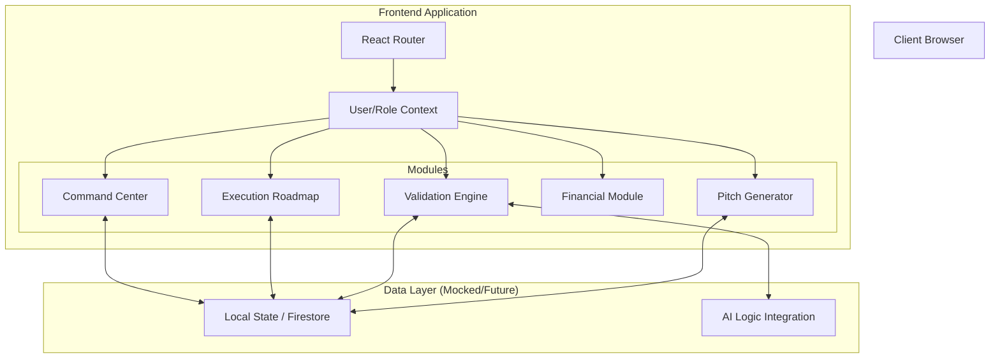

# StartupOps - The Operating System for Early-Stage Founders

**StartupOps** is a unified workspace designed to help early-stage founders manage execution, validate ideas, and align teams without juggling multiple fragmented tools.


## 🚀 Key Features

*   **Founder's Command Center**: A real-time dashboard integrating health scores, financial runway, and strategic AI insights.
*   **Execution Roadmap (Live Kanban)**: Drag-and-drop task management with milestone tracking and simulated real-time sync.
*   **Validation Engine**: Analyze customer feedback with Sentiment Gauges and detailed trend charts.
*   **Financial Monitor**: Track burn rate, MRR (displayed in ₹), and runway alerts.
*   **Role-Based Access Control**:
    *   **Founder Mode**: Full access to financials, settings, and strategic data.
    *   **Team Member Mode**: Focused view on tasks and roadmap execution.
*   **Investor Pitch Generator**: Auto-generate pitch deck outlines based on live startup data.

## 🛠️ Tech Stack

*   **Frontend**: React (Vite)
*   **Styling**: Vanilla CSS (Variables & Flexbox/Grid) for maximum customization
*   **Routing**: React Router DOM v6
*   **Icons**: Lucide React
*   **Charts**: Recharts (Data Visualization)
*   **Drag & Drop**: @dnd-kit/core
*   **Deployment**: Vercel Ready (`vercel.json` included)

## 🏗️ Architecture



## 📦 Installation & Setup

1.  **Clone the repository**:
    ```bash
    git clone https://github.com/yourusername/startupops.git
    cd startupops
    ```

2.  **Install dependencies**:
    ```bash
    npm install
    ```

3.  **Run the development server**:
    ```bash
    npm run dev
    ```

4.  **Open in browser**:
    Navigate to `http://localhost:5173`

## 👥 Roles & Permissions Demo

The application features a **Role Switcher** in the sidebar footer.
- **Toggle to "Member"**: Financial data and strategic health scores are hidden.
- **Toggle to "Founder"**: Full access to all sensitive metrics.

---
*Built for Innovation Hackathon 2026*
